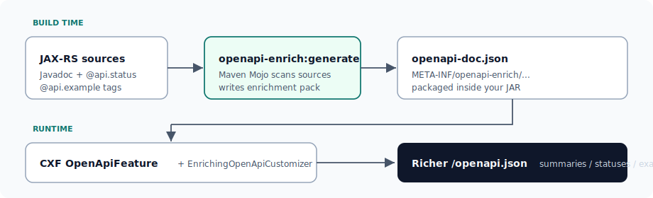
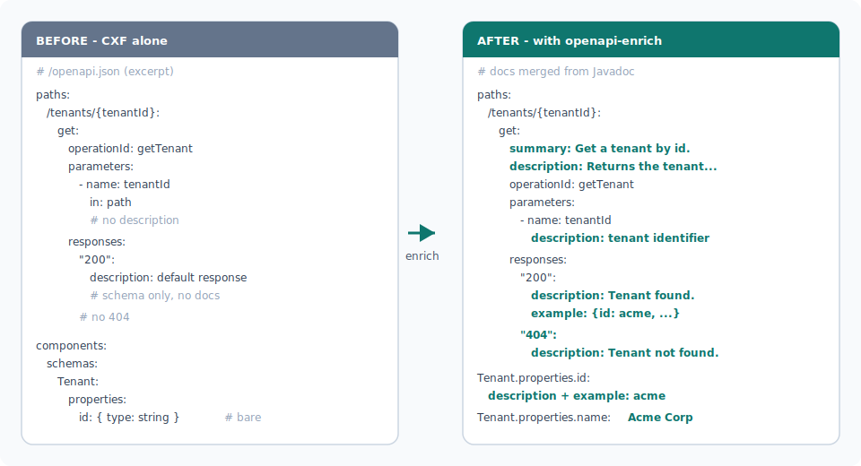

# openapi-enrich

Turn JAX-RS Javadoc into richer CXF OpenAPI docs — without duplicating everything in Swagger annotations.

**Coordinates:** `dev.inoyu.openapi:*:0.1.0-SNAPSHOT` · **License:** Apache-2.0 · **Requires:** Java 11+, Apache CXF  
**Validated in production by [Apache Unomi](https://unomi.apache.org/).** Tutorial samples stay generic (`com.example.*`).

| Artifact | Role |
|----------|------|
| `openapi-enrich-maven-plugin` | Build-time: scan sources → write enrichment pack JSON into the JAR |
| `cxf-openapi-enricher` | Runtime: merge packs into CXF `OpenApiFeature` |
| `openapi-enrich-model` | Pack POJOs · path `META-INF/openapi-enrich/openapi-doc.json` · format `1.1` |



Each module that runs the Mojo ships its own pack; the runtime loader merges every pack it finds.

---

## Before / after

Same operation, same CXF generator — teal lines are fields merged from Javadoc / `@api.*` tags.



---

## Quick start

### 0. Install (until Maven Central)

```bash
git clone https://github.com/inoyu-dev/openapi-enrich.git
cd openapi-enrich && mvn clean install
```

Pin `${openapi.enrich.version}` → `0.1.0-SNAPSHOT` in your reactor.

### 1. Document endpoints

```java
@Path("/tenants")
public class TenantResource {

    /**
     * Get a tenant by id.
     *
     * @param tenantId tenant identifier
     * @return the tenant if found, otherwise 404
     * @api.status 200 com.example.api.Tenant Tenant found.
     * @api.status 404 empty Tenant not found.
     * @api.example {"id":"acme","name":"Acme Corp"}
     */
    @GET
    @Path("/{tenantId}")
    @Produces(MediaType.APPLICATION_JSON)
    public Response getTenant(@PathParam("tenantId") String tenantId) { /* ... */ }
}
```

Field docs (often in a separate `api` module):

```java
/** Stable tenant identifier. @api.example acme */
private String id;
```

| Tag | Meaning |
|-----|---------|
| First Javadoc sentence | summary |
| `@param` / `@return` | parameter / 2xx description (`@param` Java names remap to `@PathParam` / `@QueryParam`) |
| `@api.status <code> [array] <Fqcn\|empty\|{@link T}> [desc]` | named response |
| `@api.example …` | response or property example |

### 2. Register javadoc tags (required)

Without this, `mvn javadoc:javadoc` fails on unknown `@api.*` tags. Prefer the parent plugin:

```xml
<plugin>
  <groupId>org.apache.maven.plugins</groupId>
  <artifactId>maven-javadoc-plugin</artifactId>
  <configuration>
    <tags>
      <tag><name>api.status</name><placement>a</placement><head>API Status:</head></tag>
      <tag><name>api.example</name><placement>a</placement><head>API Example:</head></tag>
    </tags>
  </configuration>
</plugin>
```

`placement` `a` = types, methods, fields. Always register `api.example` (not renameable). If you set enrich `statusTag`, register that name instead of `api.status`.

### 3. Bind the Mojo

Parent `pluginManagement` (execution once; do not enable it for every module unless you mean to):

```xml
<plugin>
  <groupId>dev.inoyu.openapi</groupId>
  <artifactId>openapi-enrich-maven-plugin</artifactId>
  <version>${openapi.enrich.version}</version>
  <executions>
    <execution>
      <id>generate-openapi-doc</id>
      <goals><goal>generate</goal></goals>
    </execution>
  </executions>
</plugin>
```

Each module that should emit a pack re-declares the plugin for config only (inherit the execution). Use `extraSourceRoots` when DTOs live elsewhere:

```xml
<plugin>
  <groupId>dev.inoyu.openapi</groupId>
  <artifactId>openapi-enrich-maven-plugin</artifactId>
  <configuration>
    <extraSourceRoots>
      <extraSourceRoot>${project.basedir}/../api/src/main/java</extraSourceRoot>
    </extraSourceRoots>
  </configuration>
</plugin>
```

```bash
mvn clean package
# → target/generated-resources/openapi-enrich/META-INF/openapi-enrich/openapi-doc.json
# (auto-registered as a resource root for the JAR)
```

### 4. Runtime dependency + wire CXF

```xml
<dependency>
  <groupId>dev.inoyu.openapi</groupId>
  <artifactId>cxf-openapi-enricher</artifactId>
  <version>${openapi.enrich.version}</version>
</dependency>
<!-- Optional direct model dep if you embed JARs in OSGi -->
<dependency>
  <groupId>dev.inoyu.openapi</groupId>
  <artifactId>openapi-enrich-model</artifactId>
  <version>${openapi.enrich.version}</version>
</dependency>
```

**Several packs / OSGi** (merge then attach):

```java
DocPack pack = new BundleContextDocPackLoader().loadMerged(bundleContext);
EnrichingOpenApiCustomizer customizer = new EnrichingOpenApiCustomizer(pack);
customizer.setDynamicBasePath(true);
openApiFeature.setCustomizer(customizer);
```

**Single JAR:** `openApiFeature.setCustomizer(new EnrichingOpenApiCustomizer());`

### 5. Optional: `HttpServlet`

```xml
<servletPaths>
  <servletPath>
    <className>com.example.health.HealthCheckServlet</className>
    <path>/health/check</path>
  </servletPath>
</servletPaths>
```

Put `@api.status` / `@api.example` on the servlet **class**.

### 6. Verify

Pack present in the JAR → OpenAPI / Swagger UI shows summary, param docs, `200`+`404`, examples. See [Troubleshooting](#troubleshooting) if not.

---

## Plugin parameters

| Parameter | Default | Purpose |
|-----------|---------|---------|
| `extraSourceRoots` | — | DTO / base-class sources outside compile roots |
| `servletPaths` | — | `className` + `path` for servlets |
| `sourceRoots` | compile source roots | Override scan roots |
| `bundleId` | `${project.artifactId}` | Pack id |
| `statusTag` | `api.status` | Status Javadoc tag |
| `outputFile` | `…/META-INF/openapi-enrich/openapi-doc.json` | Pack path |
| `includePackages` | all | Optional package filter |

```bash
mvn openapi-enrich:generate
```

---

## Troubleshooting

| Symptom | Fix |
|---------|-----|
| No pack after build | List the plugin under that module’s `<plugins>` (execution from `pluginManagement`) |
| Pack unused at runtime | Set the customizer; OSGi → `BundleContextDocPackLoader` + active bundles containing packs |
| Feature module docs missing | Run the Mojo in **each** module that should contribute a pack |
| Missing DTO docs | `extraSourceRoots` |
| `javadoc` fails on `@api.*` | Step 2 tags |
| OSGi `LinkageError` on OpenAPI types | Embed only enricher + model; Import-Package shared Jackson/CXF/Swagger |
| Schema name clash | Components use **simple** class names |

**Limits:** simple-name schema keys; one `extends` superclass only; does not rewrite CXF `allOf`; OAS3 UIs may drop text beside `$ref`.

---

## Develop / publish

```bash
mvn clean verify && mvn -Plicense-check verify
```

Maven Central: [`PUBLISHING.md`](PUBLISHING.md) · License: [`LICENSE`](LICENSE), [`NOTICE`](NOTICE)
